[TOC]


## 简介

本项目实现了Vue+Springboot前后端EqualityViewer项目,用于接受等价判断工具产生的csv文件，提供给用户交互选项进行判断。

## git操作

本项目全程使用git管理。

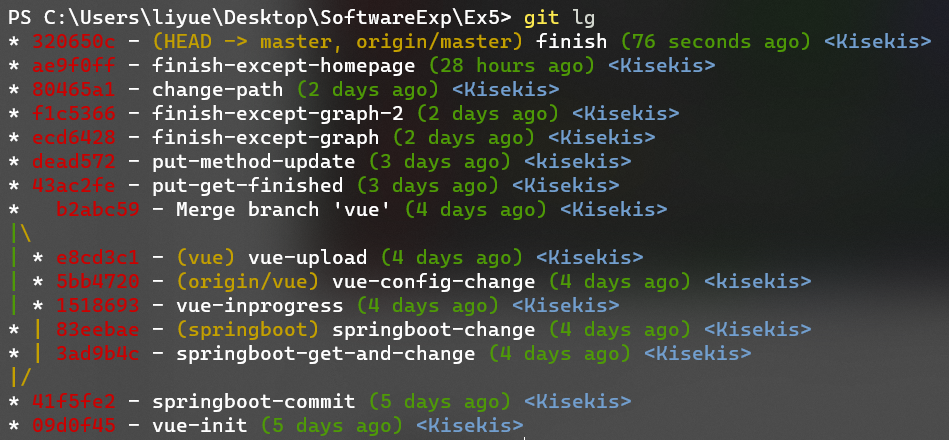

首先在master分支上创建两个初始项目，接着创建两个分支vue和springboot，分别在两个分支上进行开发，最后合并分支进行开发。

项目已发布至[Kisekis/EqualityViewer (github.com)](https://github.com/Kisekis/EqualityViewer)

关于git操作的详细部分，可以在Ex4的实验报告里找到，不想再赘述（

## 功能介绍

### 整体架构

#### Springboot

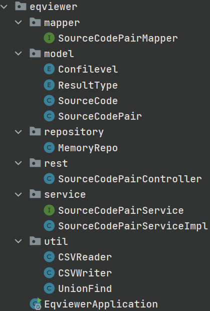

springboot实现后端部分，为MVC架构

> MVC是模型(Model)、视图(View)、控制器(Controller)的简写，是一种软件设计规范，是将业务逻辑、数据、显示分离的方法来组织代码。

* Model层

  Model层为模型层，包括数据模型（Dao）和服务模型（Service）。

  数据模型包含在model和mapper文件夹中，包括

  * [class] SourceCode ：源代码

    * String path : 路径
    * int id

  * [enum] ResultType : 判断结果

    * Equal : 相等
    * Inequal : 不相等
    * Same : 相同
    * Uncertain : 不确认

  * [enum] ConfiLevel : 可信程度

    * SUSPICIOUS : 可疑
    * RELIABLE : 可信
    * UNRELIABLE : 不可信

  * [class] SourceCodePair : 源代码对

    * SourceCode code1
    * SourceCode code2
    * ResultType result
    * ConfiLevel level

  * [mapper] SourceCodePairMapper : mapper，用于将object转换为dto对象，便于在网络上传输

    > DTO ：Data Transfer Object数据传输对象
    > 主要用于远程调用等需要大量传输对象的地方。
    >
    > 后端处理后，将对象通过mapper转换为dto再通过网络通信传到前端

    * toSourceCodePairsDto ：object list -> dto list
    * toSourceCodePairs : dto list -> object list
    * toSourceCodePair : dto -> object 
    * toSourceCodePairDto : object -> dto
    * toUnionFindDto : object -> dto
    * toUnionFind : dto -> object

  服务模型包含在service文件夹中，包括

  * [interface] SourceCodePairService : 定义了Service服务需要实现的接口
    *  List<SourceCodePair> sourceCodePairs() : 从repository中获取所有sourceCodePairs
    * UnionFind checkSourceCodePairs() : 对所有SourceCodePairs进行并查集判断，并返回并查集对象
    * void changeResult(SourceCodePair *pair*, ResultType *type*) : 更改某一对代码对结果
    * void changeLevel(SourceCodePair *pair*, Confilevel *level*) : 更改某一对代码对可信度
    * String getSourceCode(SourceCode *code*) : 以raw string形式获取代码内容
  * [class] SourceCodePairServiceImpl : 是对上面接口的具体实现

* Controller层

  Controller层为控制器层，包含在rest文件夹中

  * [class] SourceCodePairController : 控制器
    * 3.1.3节前后端通信中的表格列出了controller中的方法

* Repository

  此外还有Repository层用于存储数据，包含在repository文件夹中

  * MemoryRepo : 直接将数据存储在本地里，采用单例模式
    * getInstance() : 获取MemoryRepo唯一对象
    * getData() : 获取所有SourceCodePair，
    * getMap() : 获取所有SourceCode，用Map存储

* util

  util文件夹中用于实现业务功能，包括

  * CSVreader : 读取csv文件的类
  * CSVwriter : 写入csv文件的类
  * UnionFind : 并查集，用于进行逻辑判断

此外除了springboot以外，程序使用了一些其他maven依赖

* openapi-generator-maven-plugin

  openapi自动生成工具，会根据resources/api.yml中的openapi描述自动生成符合RESTful api规范的接口，详情请看3.1.3节

* mapstruct

  根据Mapper接口自动生成Mapper实现类，Mapper用于dto和object间互相转换。

#### Vue

vue实现前端，结合Element-plus小组件

主要包括两个组件和四个视图

**组件（Component）**:

* Aside : 用于实现侧边栏，使用了Element-plus的el-menu组件

  侧边栏实现了下面的结构

  ```
  - home view //主页视图
  - group //折叠菜单
  	- table view //表格视图
  	- graph view //图视图
  ```

* Header : 用于实现固定的上边栏

**视图（View）**：

* HomeView : 主页，只是用来占位置的
* TableView : 表格视图，会将读取的csv文件以**表格形式**展示出来，并在表格的每列提供一个el-button按钮，触发后跳转到EditorView进行判断
* GraphView : 图视图，会将读取的csv文件以**图**的形式展示出来
* EditorView : 编辑视图，会将正在判断的两个**源文件内容**展示出来，并提供两个el-button，EQUAL和INEQUAL，触发后更改当前判断的源文件对等价性结果，并跳转回TableView

**路由（route）**：

路由规定了各个视图的访问地址

| name  | view      | url    |
| ----- | --------- | ------ |
| Home  | HomeView  | /home  |
| Table | TableView | /table |
| Graph | GraphView | /graph |

EditorView是在TableView触发ChangeResult按钮后跳转的。

#### 前后端通信

采用Axios实现前后端通信，前端默认开在80端口，后端默认开在9090端口。

通信过程中遵循RESTful api。

| ControllerMethodName  | Method | api              | Description                         |
| --------------------- | ------ | ---------------- | ----------------------------------- |
| listSourceCodePairs   | get    | /codes           | 获取全体code pairs                  |
| getSourceCodePair     | get    | /codes/{codesId} | 获取某个code pair                   |
| updateSourceCodePairs | put    | /codes/{codesId} | 更新某个code pair的判断结果         |
| getSourceCode         | get    | getSourceCode    | 获取某个code源文件的内容            |
| getUnionFind          | get    | /unionfind       | 进行并查集判断，并获取unionfind对象 |
| writeSourceCodePairs  | get    | /write           | 将所有code pairs写入csv文件         |

具体接口内容（例如参数定义，Request/Response json格式等等）在resources/api.yml中

### 必做内容

#### 接受Ex4输入

> *in brief* : Springboot的MemoryRepo为单例对象，在构造时会创建一个CSVwriter对象用于读取指定路径下的CSV文件，并生成程序内的SourceCode/SourceCodePair对象。Vue需要访问时，这些对象会被Mapper转化成Dto，并传输到Vue中进行展示

Ex4会输出3个csv文件，分别记录了equal，inequal和same的程序对。

当前端对后端发出请求后，后端会返回SourceCodePairs（DTO），过程如下：

* 第一次请求时，后端会创建单例的MemoryRepo对象，并创建CSVreader进行读取，保存到MemoryRepo中
* 此后的请求，后端会直接调用MemoryRepo内的get方法，返回MemoryRepo内存储的SourceCodePairs对象，而不是再创建一个CSVreader进行读取
* 后端读取到SourceCodePairs后，会经过Mapper转成Dto，以json格式传输到前端

#### 展示需要进行人工等价性确认的两个文件

> *in brief* : 用户选择某一对需要确认的源文件后，会跳转到EditorView，EditorView创建时会向后端获取相应的两个源文件内容，以raw string的格式传回前端，前端就可以展示两个文件。

用户在前端TableView可以选择一对源文件进行判断，触发按钮后会跳转到EditorView，EditorView用于展示两个文件。过程如下：

* 用户在TableView选择一对文件，点击按钮跳转到EditorView

* 在跳转到EditorView后，EditorView从TableView得到query id
* EditorView根据得到的id向后端发出请求，请求获取两个源文件
* 后端从MemoryRepo中根据id获取两个源文件的路径，并启动一个FileReader读取两个源文件到String对象内
* 后端以raw string的格式将源文件内容返回给前端
* 前端进行展示

#### 用户提供交互选项

> *in brief*: 在TableView中，用户可以查看导入的csv文件，并且每一项提供ChangeResult按钮，触发按钮后跳转到EditorView，展示两个文件，并提供EQUAL和INEQUAL按钮用于判断，判断完后会跳转回TableView。在GraphView中，用户可以拖动节点，观察形成的图。在完全处理完后，用户可以单击TableView的Write按钮，将结果写入csv文件

程序所有的可交互功能如下：

* 侧边栏的菜单，可以跳转到首页（HomeView）或表格视图（TableView）或图视图（GraphView）

  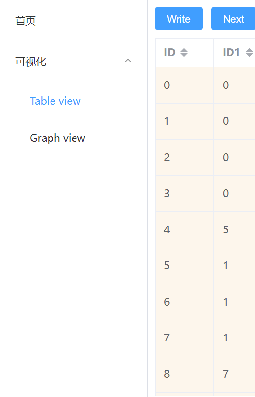

* TableView下表格可以对ID（程序对的id），ID1（当前程序对第一个源程序的id），ID2（当前程序对第二个源程序的id）进行排序，对Result（判断结果）进行筛选

  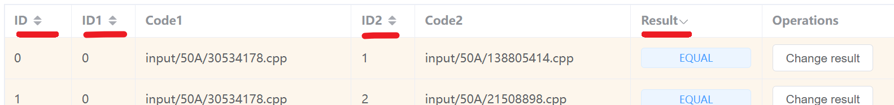

  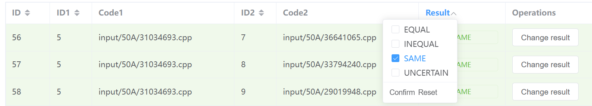

* TableView 表格中每一条目有Change result按钮，可以跳转到EditorView进行判断

  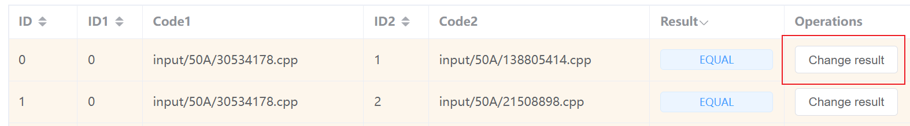

* TableView上有Write和Next按钮，分别用于最终写入结果和自动推荐下一个待判断的条目

  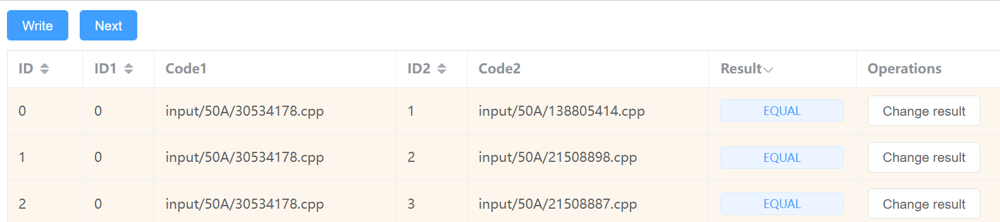

* GraphView中图像可拖拽

  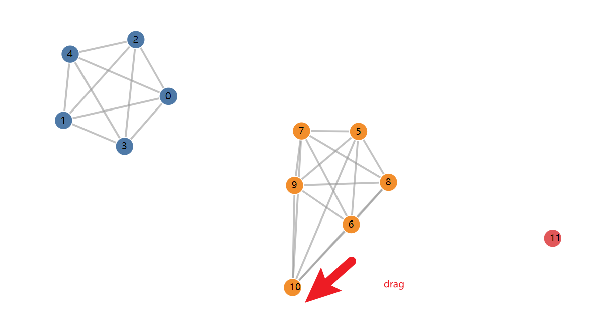

* EditorView中提供Equal，Inequal，Uncertain按钮用于判断，触发后返回TableView并更新数据

  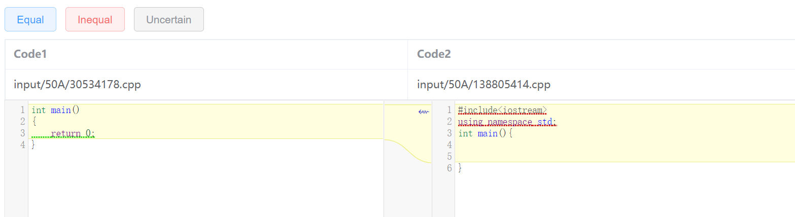

#### 根据用户的人工判定结果自动推荐下一个需人工确认的等价对

> *in brief* : UnionFind用来实现推荐逻辑，每次根据UnionFind判断结果会为每个程序对给出Unreliable，Reliable，Suspicious的标签，分别代表不可靠，可靠，可疑。程序会先自动推荐可疑的程序对供用户判断，接着是不可靠的，直到所有程序对变为可靠的。

判断逻辑 ：UnionFind并查集实现

将程序对建模成图，由于每对程序都要有一个结果，得到的一定是完全图，共$C_n^2$条边。

现在假设只保留结果为Same或Equal的边，将结果为Inequal或Uncertain的边去掉，应该得到若干个连通分支，且每个连通分支都是一个完全图，说明这个连通分支内的所有文件都是等价的。

如果有一个连通分支不是完全图，肯定存在问题。

因此采用并查集实现检查，首先将Same或Equal的边相邻的两个节点归为一类，再检查所有Inequal或Uncertain的边相邻的两个节点，如果这两个节点属于一类，说明判断结果出错了。

**由于程序初始读取的csv是从Ex4生成的，可以认为，Ex4中生成的Inequal和Same一定是Reliable可靠的**，因为Inequal代表至少有一个输出不同，Same代表文件内容直接相同。那么只需要考虑Equal是否可靠即可，因为Equal靠程序是无法穷尽所有输入的。

因此

* 初始化时，将所有Inequal/Same对标记为Reliable可靠，Equal标记为Unreliable不可靠

  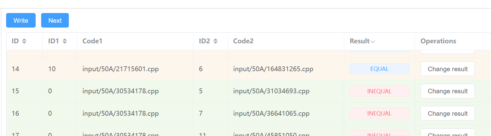

  在表格中，Reliable可靠的条目底纹是绿色的，Unreliable不可靠的是橙色的

* 在判断完某一个程序对的结果后，这个程序对被标记为可靠的，也就是默认用户的判断是正确

  的

  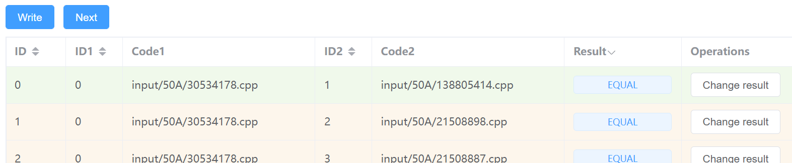

  这里判断完了ID为0的条目，变为了绿色

* 在判断完某一个程序对的结果后，进行一次UnionFindCheck，将所有不符合判断逻辑的程序对均设置为Suspicious怀疑的。

  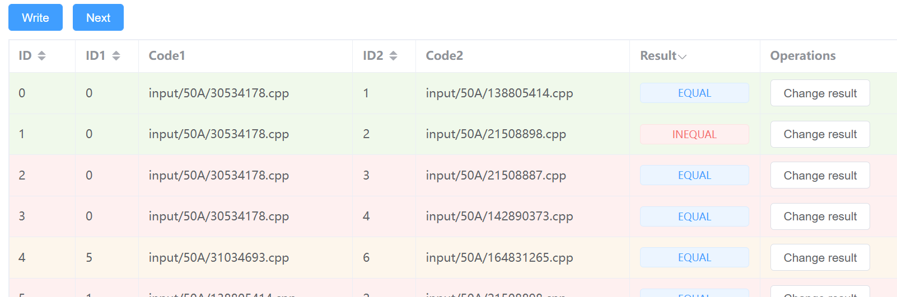

  这里将ID为1的程序对从Equal手动判断为Inequal，会导致一些程序对被标记为Suspicious，底纹变成红色。

  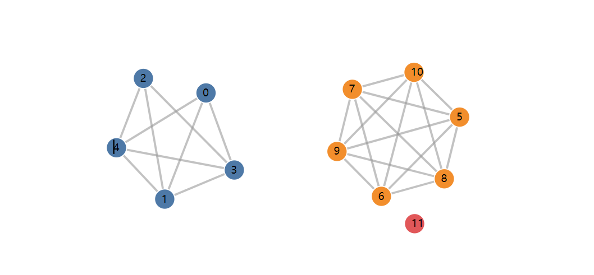

  GraphView中也能看出，蓝色部分的不是完全图了，因此一定有错的结果

* 用户可以单击Next按钮，会自动推荐下一个标签为Suspicious的程序对进行判断

* 当所有Suspicious的程序对被消除后，会继续推荐标签为Unreliable的程序对

  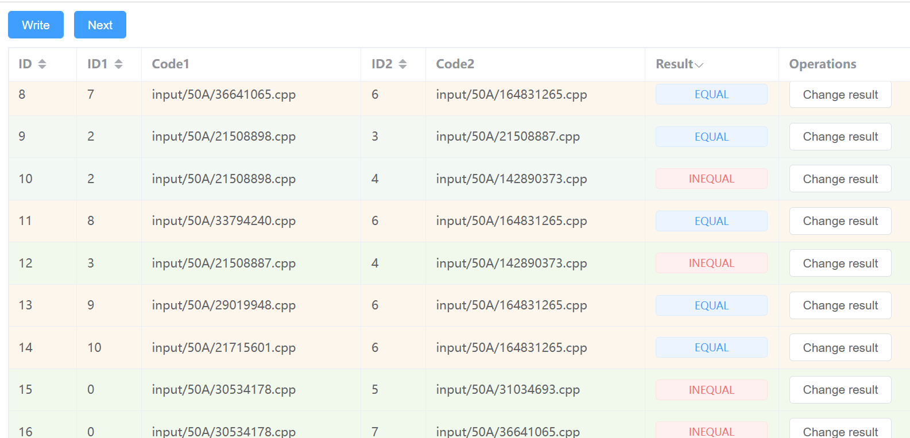

  现在所有Suspicious的程序对都被消除，也就是没有红色底纹了

  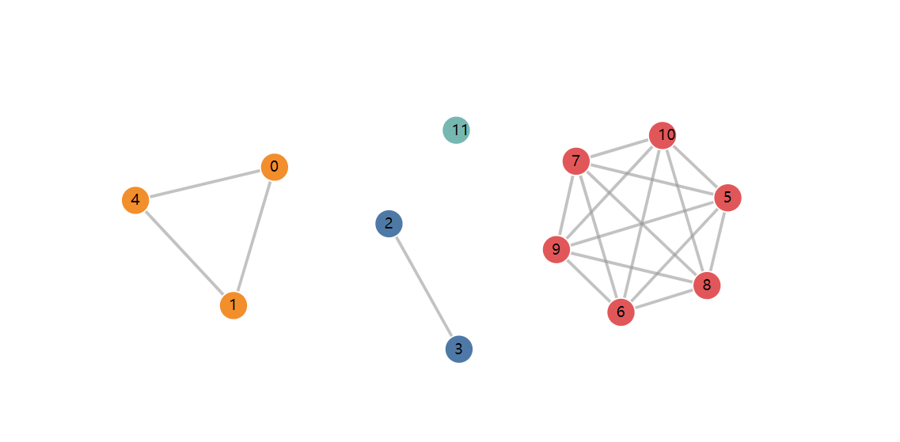

  从GraphView也能看出来，每个连通分支都是连通图，正确

* 当所有Unreliable的程序被消除后，再点击Next会告知用户已经结束了

  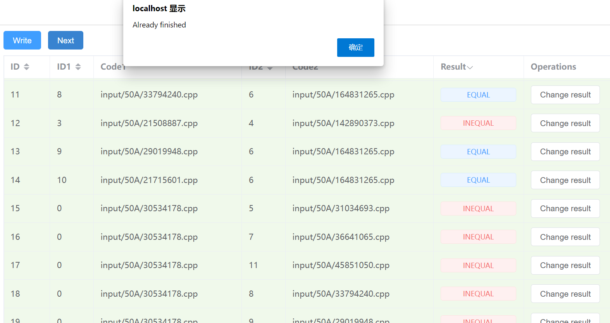

#### 对等价集合进行更新，并**输出人工确认后的等价程序对**

> *in brief* : 在用户点击EditorView的EQUAL/INEQUAL按钮后，会向后端传输put请求用于更新信息，前端也会更新信息达成前后端数据同步。用户点击TableView的write按钮后，会向后端发出write请求，后端会创建CSVwriter用于写入数据，成功写入后会向前端返回OK状态，前端再响应提示写入成功。

用户在EditorView选择Equal/Inequal/Uncetain后，会更新数据，过程如下：

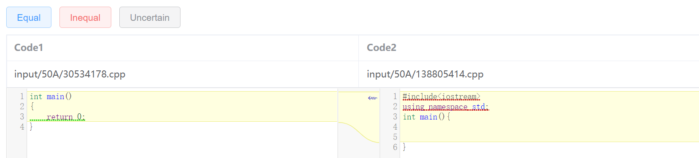

* 触发按钮，例如Inequal
* 前端向后端发出put请求，参数为当前判断的程序对id，以及判断结果result
* 后端获取到put请求，更新MemoryRepo中的数据

用户在TableView选择Write后，会写入数据，过程如下：

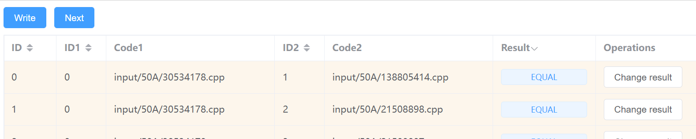

* 触发Write按钮
* 前端向后端发出write请求，后端接收到数据
* 后端创建CSVwriter，并将MemoryRepo中的数据写入到output文件夹中

### 额外功能

#### CodeDiff

使用diff-match-patch库实现代码间显示不同算法。

> [google/diff-match-patch: Diff Match Patch is a high-performance library in multiple languages that manipulates plain text. (github.com)](https://github.com/google/diff-match-patch)

实现的功能如下

* 对某一对代码判断时载入代码内容
* 代码框显示行号，对长代码有滚动条
* 显示两个代码间不同
* 代码高亮

以下为Code Diff展示

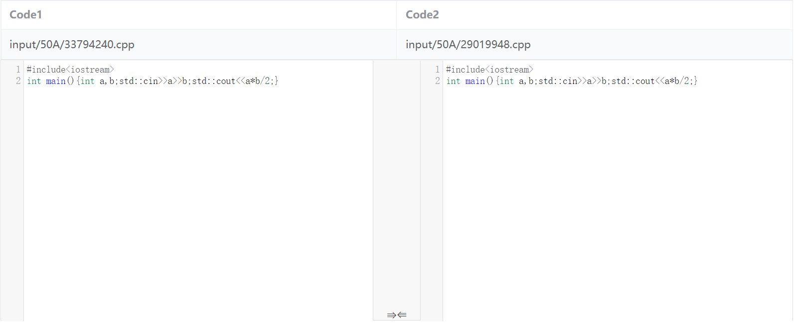

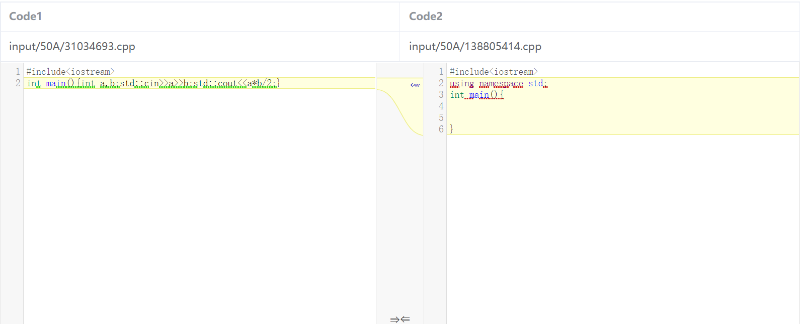

#### Graph

使用d3.js库实现画图功能。

可以将单个代码建模成一个顶点，边集为标记为Same或Equal的代码对，将属于同一个公共UnionFind子集中的代码视为一组，分配唯一的颜色。

实现的功能如下

* 可拖拽
* 每一次判断后实时更新
* 不同连通分支（UnionFind判断）颜色不同
* 使用力导向图对节点布局

以50A文件夹中的代码为例，经过等价判断工具初步判断后，得到以下结果。

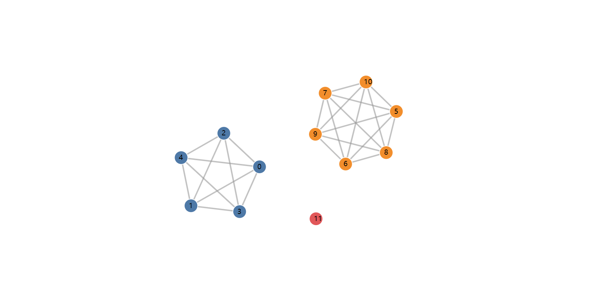

如上图所示，0,1,2,3,4号代码属于同一组，它们间的等价性相同。

5,6,7,8,9,10号代码属于同一组，它们间的等价性相同。

11号代码单属一组，没有其他代码和它等价性相同。

如果结果是正确的，最后得到的图中**每个连通分支一定是完全图**，因此可以进行可视化判断。

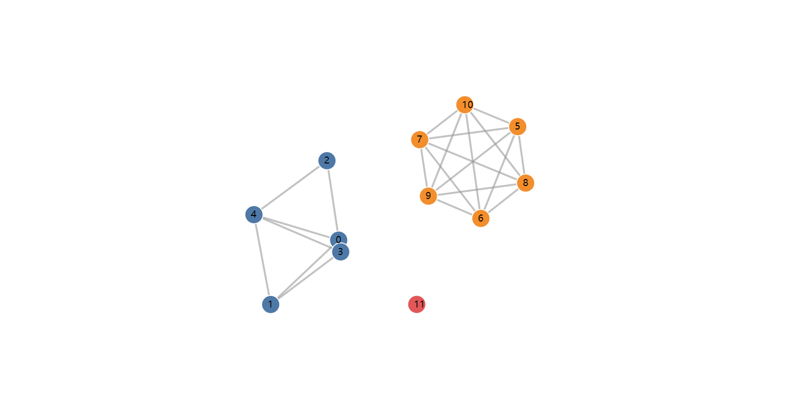

上图为处理过程中的图，可以发现0,1,2,3,4非完全图，因此结果肯定不对。

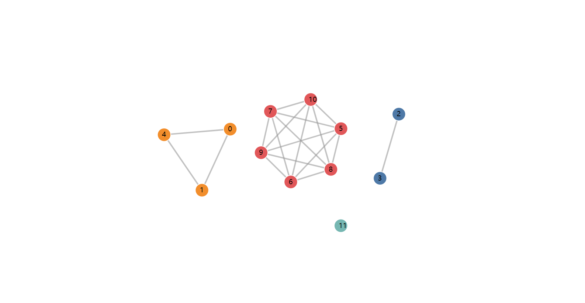

当所有代码对处理完成后，形成了四个联通分支，每一个连通分支均为完全图。

## 运行流程

### 安装/启动

#### For Vue

安装node.js

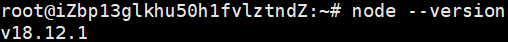

```
cd vue
npm install
npm run serve
```

#### For Springboot

安装jdk11和maven

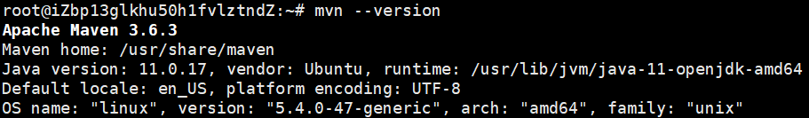

```
cd springboot
mvn install
mvn compile
mvn spring-boot:run
```

> 如果路径有误可以修改resources文件夹下的application.properties，里面的path配置
>
> 在Ubuntu系统上测试需要去掉/springboot变为./src/main/resources/data

### 运行

运行过程已录制视频发布至bilibili。

[软件工程实验五_哔哩哔哩_bilibili](https://www.bilibili.com/video/BV1H24y1k7Pb/)

程序开在了我的服务器上，可以在此测试（如果还在的话）

[eqviewer-vue (nime.love)](http://nime.love/home) 前端

[eqviewer-springboot(nime.love)](http://nime.love:9090/api/codes) 后端接口

* 将输入放置在resources/data文件夹中

  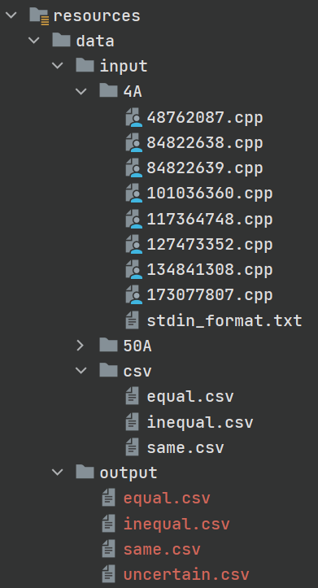

  ```
  -data
  	-input
  		-4A
  			-xx.cpp
  		-50A
  			-xx.cpp
  		-csv
  			-equal.csv
  			-inequal.csv
  			-same.csv
  	-output //初始为空
  ```

* 启动Springboot和Vue项目，浏览器访问localhost（默认80端口）

* 不断点击Next直到所有条目变成Reliable（可信的，绿色底纹）

* 结束后点击Write，写入到data/output中

## GUI展示

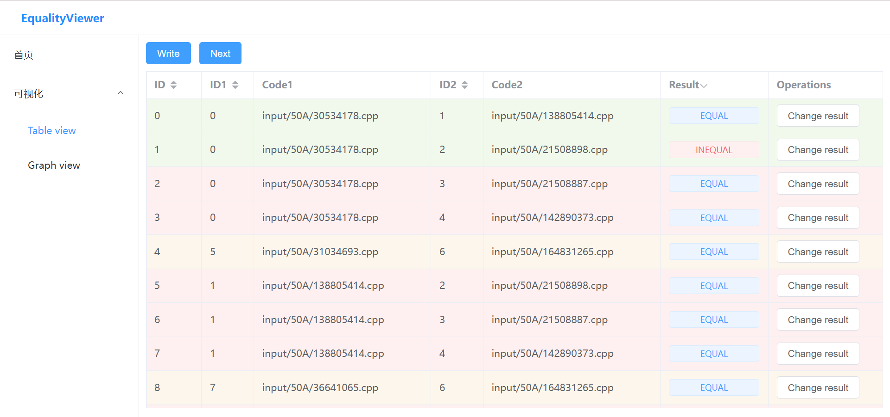

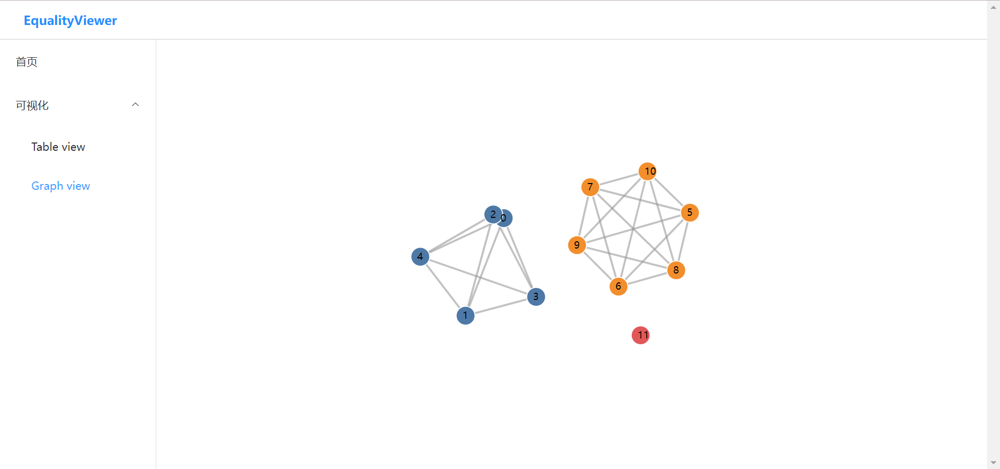

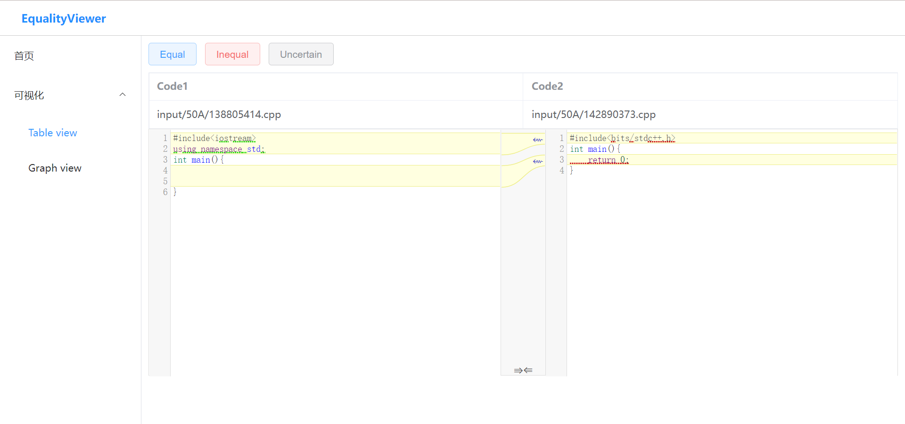

